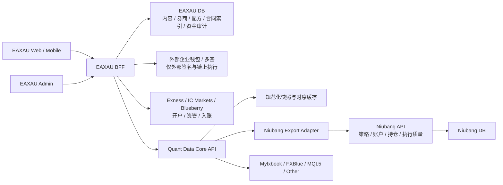

# EAXAU AI 量化联盟：产品与系统架构

状态：AI 量化联盟正式产品基线
日期：2026-08-24
目标：以固定六款策略目录（每笔委托选 1–6 款）、1 至 3 家可选执行券商、持续资管和三条独立 USDT 账路为主入口，同时把现有大量 EA 名录完整保留为独立商城/资料库。

## 1. 产品一句话

客户先看懂六款策略的运行状态，再从中选择 1–6 款，组合资金、风控、执行券商、开户接入和资金路由，形成可解释、可校验、可追踪的持续资管方案。

```text
量化方案 = 资金规模 × 风险预算 × 六策略组合 × 执行券商 × 开户接入 × 资金路由
```

## 2. 不可变边界

1. 首页始终只有六个主策略席位；每笔委托可选 1–6 款，所选权重必须合计 100%。后台可替换席位内容；大量 EA 统一进入独立资料库页面，不挤占首页席位。
2. 收益、回撤、净值、持仓和交易记录必须带数据来源、更新时间和 `LIVE/DEMO/STALE` 状态。
3. AI 量化联盟是一个持续资管产品，不再拆成“资管模式/券商模式”或按期限建立会话。差异只在开户接入和资金路由：资金可由客户直充券商，也可在券商书面许可后由平台代收再划转。签约、开户、入金、资金归属、交易授权和执行主体必须逐项明确展示。
4. 牛帮的复制交易、风控与账户数据继续由牛帮拥有；EAXAU 只通过稳定契约读取获授权的数据。
5. 不允许 EAXAU 查询牛帮数据库，不允许复制牛帮私有表结构，不允许 UI 直接调用牛帮 tRPC。
6. V2 六策略体验已作为根首页；原 EA 商城保留在 `/market`，V2 内另有 `/v2-preview/ea-library` 兼容入口。
7. 平台是独立技术与运营方。Exness、IC Markets 与 Blueberry Markets 仅称“可选执行券商”或“接入通道”，不得表述为已建立官方合作、获得背书或已经批准平台代收。

## 3. 开户接入、资金路由与配置来源

开户接入、资金路由和“谁做配置”是三个不同维度，数据库、API 与 UI 必须分开建模。所有组合都属于同一个 AI 量化联盟持续资管产品。

### 3.1 开户接入

#### 客户自行开户 `SELF_OPENED`

- 客户在本人选择的券商完成开户、KYC 和入金，再提交脱敏账户参考信息。
- 平台核验交易授权、策略兼容性与账户映射，不索取客户密码、验证码、API Key 或出金凭据。
- 资金路由只能使用 `BROKER_DIRECT`。

#### 平台协助接入 `PLATFORM_ASSISTED`

- 平台协助客户准备开户、管理人/MAM/PAMM 接入、账户映射与交易授权材料。
- 客户资金仍可直接进入本人券商账户，也可在对应券商书面许可已登记且当前范围匹配时使用平台代收。
- “平台协助”不等于平台替客户持有登录凭据、绕过 KYC 或自动取得出金权。

### 3.2 资金路由

#### 客户直充券商 `BROKER_DIRECT`

- 客户从本人钱包向本人券商后台当时显示的地址付款。
- 平台只保存指引来源、付款申报、Tx Hash、异常与券商最终入账参考；不生成或猜测券商地址。
- 券商后台显示的币种、网络、限额、费用与地区资格是最终依据。

#### 平台代收再划转 `PLATFORM_COLLECTION`

- 只允许与 `PLATFORM_ASSISTED` 组合，并由每家券商各自的书面许可门控；默认关闭。
- 每笔意向使用专用地址，默认不复用；付款钱包归属声明、筛查/冻结、链上对账、管理员动态验证、外部钱包转出 Tx、券商入账和退款/异常逐笔留痕。
- 私钥、助记词和外部签名密钥不进入 EAXAU 数据库或 Web 进程。链上转出由外部企业钱包/多签系统执行，EAXAU 只记录受控请求、批准和结果。
- EA 商品收款地址、客户直充券商地址和平台资管代收地址属于三本独立账，不得混用。

### 3.3 配置来源

```text
RECOMMENDED   系统根据资金、风险偏好和可用平台生成初稿
CUSTOM        客户自己拖放、选择和调整权重
OPERATOR      运营或技术方代客户建立草稿，客户确认
```

配置来源不是服务模式。无论谁创建草稿，都必须由服务端再次校验六策略、1 至 3 家券商、开户接入和资金路由约束。

## 4. 首页信息架构

首页第一屏应直接进入产品，不做大段营销落地页。

1. 顶部：EAXAU、四个必要导航、数据状态和联系入口。
2. 六策略概览：组合权益、近 90 日、最大回撤、运行席位与最近同步时间。
3. 六策略矩阵：桌面端首屏直接看到六张卡，移动端单列；席位数量稳定，不因加载状态发生布局跳动。
4. 每张策略卡：视觉图、策略短名、版本、简介、90 日收益、最大回撤、风险等级、资金门槛和数据来源。
5. 页面内选配器：按“资金 × 风控 × 六策略 × 执行券商 × 开户接入 × 资金路由”逐项选择，并持续展示当前方案。
6. 接入入口：`SELF_OPENED` 与 `PLATFORM_ASSISTED` 二选一；资金路由根据接入方式和券商许可动态提供。
7. 高级分仓编辑器：允许在 1 至 3 家可选执行券商间设置资金与策略权重，不替代首页核心流程。

六张策略图使用同一视觉体系但不同构图。图内最多放一个短关键词，例如“金戈铁马”，不重复卡片中的完整策略名，不使用大段 AI 风格文本框。

## 5. EA 资料库/商城（保留）

现有大量 EA 不删除、不塞回首页，而是集中到一个独立页面。它是“产品资料与咨询目录”，与六款可分仓的核心策略分开建模。

- 建议路由：`/ea-library`；现有策略列表路由可以先重定向或复用，避免旧链接失效。
- 保留搜索、平台、品种、策略类型、状态、排序和分页/增量加载。
- 保留 EA 详情、图文介绍、证据占位、评论、收藏、后台编辑和联系咨询。
- 下载链接未配置或指向开户推广站时，统一进入联系方式页面；不能显示可点击但无结果的按钮。
- 商城卡片不统一标“免费”，默认使用“联系咨询”；有真实价格或授权方式时再单独配置。
- 商城 EA 可以有回测或实盘资料，但只有绑定了真实数据源时才能展示 `LIVE` 指标。
- 商城 EA 不自动进入六策略组合、推荐算法或客户分仓；进入核心策略必须经过独立的席位绑定与数据审核。
- 后台把“六策略席位”和“EA 资料库”分成两个入口，避免运营编辑时误改核心组合。

领域模型必须分开：

```ts
type CoreStrategy = {
  id: string;
  homeSlot: 1 | 2 | 3 | 4 | 5 | 6;
  dataSourceId: string;
};
type EaCatalogItem = {
  id: string;
  title: string;
  platform: "MT4" | "MT5";
  contactOnly: boolean;
};
```

同一个 EA 可以经审核后关联某个 `CoreStrategy`，但两者 ID、发布状态和权限不共用。

## 6. 策略详情

策略详情由数据区和内容区组成。

### 6.1 固定数据区

- 当前状态、数据源和最近同步时间。
- 净值/余额曲线，可切换 7D、30D、90D、全部。
- 收益、最大回撤、浮动盈亏、交易笔数、平均持仓时间。
- 当前持仓和最近交易；无授权时显示明确权限状态。
- 风险标签、适用品种、平台兼容性和最低建议资金。

### 6.2 可编辑内容区

后台以有序内容块编辑，前台只负责渲染。首批块类型：

```text
rich_text       标题、段落、列表和引用
media           图片或视频，含说明与替代文本
metric_group    有来源的指标组
equity_chart    指定账户与时间范围的净值图
evidence        证据、截图、链接和核验状态
timeline        版本、测试或实盘里程碑
risk_notice     策略专属风险说明
faq             常见问题
cta             联系、申请试盘或进入分仓
```

内容必须有草稿、预览、发布、版本和回滚记录。上传图片生成 WebP/AVIF 多尺寸版本，禁止列表页直接加载原图。

## 7. 量化方案配置器

### 7.1 页面结构

- 顶部：开户接入、资金路由、资金基数、币种和风险预算。
- 左侧/上方：六个可用策略模块。
- 中间：最多三个已启用的券商执行槽。
- 右侧/底部：权重汇总、预计成本、风险暴露、校验问题和确认按钮。
- 移动端不用强制拖拽，改用“加入券商”菜单和步进器；桌面拖拽与点击都会先打开策略规格，确认后再加入方案。

### 7.2 券商对比维度

| 维度       | 数据要求                                       |
| ---------- | ---------------------------------------------- |
| 点差与佣金 | 按品种、账户类型和时间段保存，显示采样时间     |
| 返佣       | 保存币种、每手规则、生效日期、资格条件和上限   |
| 额外权益   | 只展示可核验的活动与适用条件                   |
| 出金速度   | 展示样本量、P50/P95 或官方声明，不写“保证到账” |
| 执行质量   | 延迟、滑点、拒单率和统计窗口                   |
| 监管与地区 | 保存实体、地区限制和可开户状态                 |
| 兼容性     | MT4/MT5、账户类型、支持策略和最低资金          |

### 7.3 配方模型

```ts
type AllianceManagedDraft = {
  id: string;
  version: number;
  onboardingMode: "SELF_OPENED" | "PLATFORM_ASSISTED";
  fundsRoute: "BROKER_DIRECT" | "PLATFORM_COLLECTION";
  source: "RECOMMENDED" | "CUSTOM" | "OPERATOR";
  targetCapital: string;
  settlementAsset: "USDT";
  riskProfile: "CONSERVATIVE" | "BALANCED" | "AGGRESSIVE";
  maxDrawdownPct: number;
  strategies: Array<{
    strategyId: string;
    weightPct: number;
    riskMultiplier: number;
  }>; // 固定 6 款且总权重为 100%
  executionSlots: Array<{
    brokerId: "exness" | "ic-markets" | "blueberry-markets";
    capitalWeightPct: number;
  }>; // 1–3 家且总权重为 100%
  dataMode: "DEMO" | "CUSTOM" | "LIVE" | "HYBRID";
};
```

`PLATFORM_COLLECTION` 与 `SELF_OPENED` 的组合必须被服务端拒绝。金额用十进制字符串传输，避免浮点金额误差。百分比由 API 统一定义为 `0..100`，不允许部分接口使用 `0..1`。

### 7.4 必须执行的校验

1. 券商执行槽权重合计为 100%。
2. 每个券商执行槽内策略权重合计为 100%。
3. 启用可选执行券商数为 1 至 3 个，且只能是 Exness、IC Markets 或 Blueberry Markets。
4. 策略与券商、账户类型、地区和交易终端兼容。
5. 满足券商与策略最低资金要求。
6. 单券商、单策略和同类策略集中度不超过风险规则。
7. 风险倍率和预估最大回撤不超过客户风险预算。
8. 返佣与成本只按当前有效规则计算，并返回规则版本。
9. 任何过期、缺失或演示数据都产生可见告警，不能静默通过。
10. 平台代收必须同时满足 `PLATFORM_ASSISTED`、对应券商许可为 `APPROVED`、网络与金额在许可范围内；否则阻止创建代收意向或分配地址。

校验输出分为 `ERROR`、`WARNING`、`INFO`。只有 `ERROR` 会阻止提交；警告必须由客户显式确认并写入审计记录。

## 8. 客户账户页

### 8.1 AI 量化联盟账户

- 合同状态、服务技术方、开户接入、资金路由和券商账户映射。
- 当前权益、余额、浮盈亏、阶段收益和最大回撤。
- 资金曲线、策略贡献、券商分布、持仓和交易记录。
- 数据中断、风险事件和运营通知。
- 资金链路分别展示客户直充或平台代收的当前步骤；“Tx 已提交”“平台已收款”“已转出”“券商已入账”不得合并为同一状态。
- 只读呈现正在执行的策略，不出现会让客户误以为能直接控制技术方仓位或平台掌握其出金凭据的按钮。

### 8.2 券商执行槽

- 当前配方版本与每个券商执行槽的资金权重。
- 每个券商账户的连接、同步和执行质量状态。
- 策略贡献、持仓、交易、风险预算使用量和集中度。
- 调整草稿与当前生效版本分离；修改先进入审核/确认流程。

## 9. 系统架构



### 9.1 EAXAU BFF

- 负责 EAXAU 登录、页面聚合、内容发布、券商目录、配方草稿、合同索引、资金意向、审批和审计。
- 可继续使用内部 tRPC，但浏览器不直接访问 Quant Data Core 或牛帮。
- 不保存交易密码、券商原始令牌、钱包私钥、助记词或牛帮内部错误详情；不在 Web 进程中签名链上转出。

### 9.2 Quant Data Core

- 新建独立服务与独立仓库，使用品牌中立命名。
- 规范化不同提供方的策略、曲线、持仓、交易与账户快照。
- 提供版本化 REST/JSON 与 SSE；缓存公开数据并对私有数据做权限透传。
- 每条数据返回 `source`、`observedAt`、`receivedAt`、`freshness` 和 `dataMode`。
- 未来其他品牌只新增租户、主题与权限，不复制一套数据抓取代码。

### 9.3 Niubang 适配层

- 当前阶段由 EAXAU BFF 的 `NiubangQuantDataProvider` 只读转换公开 `signal.detail`，不触碰 copy engine 写路径。
- 六个 EAXAU 策略 ID 通过环境变量映射到牛帮公开 slug；未映射席位保留 `DEMO`，读取失败显示 `OFFLINE`。
- 客户账户阶段再在牛帮增加独立 Export Adapter，复用 `mySubscriptions`、`myMirrors`、`mySubscriptionMetrics` 与 `myExecutionQuality` 的只读投影。
- 私有账户适配器必须使用服务身份、租户 scope、用户授权映射、字段白名单和审计日志。
- 现有牛帮接口行为与返回结构不修改。

## 10. 数据归属

| 数据                         | 权威来源                  | EAXAU 是否保存            |
| ---------------------------- | ------------------------- | ------------------------- |
| 六策略展示与内容块           | EAXAU                     | 是                        |
| EA 资料库、详情与咨询规则    | EAXAU                     | 是，与核心策略分表/分模型 |
| 券商成本与返佣规则           | EAXAU/运营核验            | 是，带版本                |
| 分仓草稿与生效方案           | EAXAU                     | 是，版本化                |
| EA 商品 USDT 支付            | EAXAU 商户支付账          | 是，与资管资金分账        |
| 客户直充券商申报与入账结果   | 客户/券商                 | 保存必要指引、Tx 与结果   |
| 平台代收、筛查、转付与异常   | EAXAU 审计账/外部钱包/券商 | 保存追加式记录，不存私钥  |
| 代收地址与实际链上余额       | 外部企业钱包/区块链       | 仅保存公开地址与必要投影  |
| 策略实盘快照                 | Quant Data Core/Provider  | 只缓存必要投影            |
| 牛帮订阅、镜像持仓、执行质量 | Niubang                   | 不复制原表，只读投影      |
| 合同原件                     | 指定合同系统              | 仅保存索引和状态          |
| 交易密码与提供方令牌         | Provider/Niubang 密钥系统 | 否                        |

## 11. 数据真实性与演示环境

- 开发和 UI 评审允许生成占位收益、曲线、持仓和评论，但所有响应必须是 `dataMode: DEMO`。
- 运营可在 `/admin/v2-data` 维护接入前历史，保存后标记为 `CUSTOM`，不得标记为实盘。
- 只读实盘接入后可设置 `historyHandoverAt`；接管线之前保留迁移历史，之后仅接受 Provider 实盘点，并标记为 `HYBRID`。
- 演示页面显示固定“模拟数据”标识，截图也不能裁掉该标识。
- 生产环境只有通过来源映射和新鲜度校验的数据可标记 `LIVE`。
- 超过策略定义的同步阈值自动变为 `STALE`，收益数字仍可见但必须降级提示。
- 图片、图文说明和评论可先占位；账户金额、实盘收益、监管信息和平台成本不能无标识虚构。

## 12. 性能目标

- 首页首个可见内容：移动网络下目标 2.5 秒内。
- 六策略摘要由单个聚合接口返回，禁止六张卡分别发起瀑布请求。
- EA 资料库必须服务端分页或游标加载，不把全部名录和原图一次发送到浏览器。
- 首屏图片使用响应式尺寸、现代格式和 CDN；列表图建议 80 至 160 KB。
- 曲线首屏最多 120 点，详情按时间范围渐进加载。
- 实时更新采用 SSE 增量事件，断线后回退到 30 至 60 秒轮询。
- 所有列表和图表保持稳定尺寸，加载、空状态和数值变化不推动布局。

## 13. 发布路线

### Phase 0：契约冻结

- 审阅六策略名称、三家可选执行券商、两种开户接入、两种资金路由和风险字段。
- 冻结 API Draft 0.2 与四种数据模式标识。

### Phase 1：可点击纵向样板

- 新建 V2 路由与功能开关。
- 完成六策略首页、一个策略详情、分仓配置器和只读账户概览。
- 将现有 EA 商城作为独立资料库入口接入 V2 导航，保持旧链接和后台编辑能力。
- 使用本地 Demo Provider，后台可编辑内容块。

### Phase 2：公开实盘数据

- 当前可通过 Niubang 公开策略只读映射接入快照、曲线、持仓、成交和数据新鲜度。
- 后续部署 Quant Data Core，把多来源接入迁移到品牌中立服务。
- 不接入客户私有账户，不影响牛帮交易路径。

### Phase 3：账户授权

- 增加 Niubang Export Adapter 服务鉴权和用户授权映射。
- 接入账户权益、持仓、交易与执行质量。
- 完成字段脱敏、审计、限流和撤销授权。

### Phase 4：方案确认、资管接入与资金运营

- 配方版本、规则版本、人工审核、客户确认、合同索引与交易授权上线。
- 客户直充券商记录真实入账结果；平台代收按券商书面许可逐家启用，并完成地址、筛查、对账、动态验证、外部钱包转付、券商入账与异常演练。
- 企业钱包或多签负责外部签名；EAXAU 不持有私钥。是否连接真实交易执行必须经过独立生产验收，不能由界面状态推断。

## 14. 尚待业务确认

- 六款策略的正式名称、唯一 ID、数据账户和风险分类。
- 三家可选执行券商的适用实体、地区、账户类型、成本与返佣数据来源。
- 资管合同由谁签署、交易授权边界、资金归属及各方责任。
- 三家券商的管理人/MAM/PAMM 生产资格，以及哪些实体书面允许平台代收再划转。
- 企业钱包/托管服务账户、地址策略、审批策略和 API/Webhook 生产配置。
- 推荐算法第一版使用规则引擎还是人工模板。
- 试盘链接是外部观察链接、只读账户，还是站内嵌入数据。
